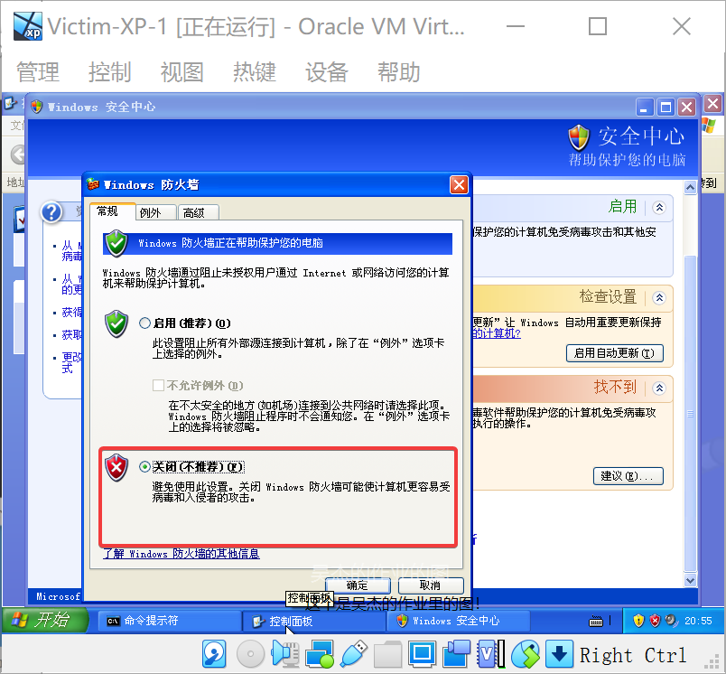

推荐：[PDF版本报告](readme.pdf)

# 作业说明

## 实验目的

* 掌握 VirtualBox 虚拟机的安装与使用；
* 掌握 VirtualBox 的虚拟网络类型和按需配置；
* 掌握 VirtualBox 的虚拟硬盘多重加载；

## 实验环境

以下是本次实验需要使用的网络节点说明和主要软件举例：

* VirtualBox 虚拟机
* 攻击者主机（Attacker）：Kali Rolling 2019.2
* 网关（Gateway, GW）：Debian Buster
* 靶机（Victim）：From Sqli to shell / xp-sp3 / Kali

## 实验要求

* 虚拟硬盘配置成多重加载，效果如下图所示；


* 搭建满足如下拓扑图所示的虚拟机网络拓扑；


> 根据实验宿主机的性能条件，可以适度精简靶机数量

* 完成以下网络连通性测试；
    * \[ \] 靶机可以直接访问攻击者主机
    * \[ \] 攻击者主机无法直接访问靶机
    * \[ \] 网关可以直接访问攻击者主机和靶机
    * \[ \] 靶机的所有对外上下行流量必须经过网关
    * \[ \] 所有节点均可以访问互联网

## 实验报告要求

* Markdown 书写，且在 Github 上渲染出的排版效果正常，可读性强；
* 在 Github 上每次提交作业单独从 `master` 分支 **新** 开一个分支；
    * 每次作业均保存到 **独立不冲突** 的子目录；
* 图文并茂证明：
    * 实验关键步骤是自己做的；
    * **哪些** 实验结果符合实验要求预期；
* 如有涉及到代码、配置文件，请记得 `commit` **源代码** 文件；
* 规范的 Git 工作流程：
    * **提交作业等待批改**：提交 `PR` 请求将作业分支合并到 `master` 分支；
        * 未 `PR` 时的 `commit` 不会被批改；
    * 课程没有在教务处系统上查到分数之前，**禁止合并或关闭** 已有批改记录的 `PR`，可以在该 `PR` 对应的分支上继续提交新变更；；
    * 每次实验报告只保留一个 `Open` 状态的 `PR` ，禁止同一次作业发起多个 `PR`；
    * `PR` 的标题应体现本次实验报告的主题；

> 示例作业目录（所有分支合并到 master 分支后状态）如下：

    .
    ├── .gitattributes
    ├── .gitignore
    ├── README.md
    ├── chap0x01
    │   ├── README.md
    │   └── img
    │       ├── vb-setup.png
    │       └── vb-victim-screenshot-1.png
    ├── chap0x02
    │   └── README.md
    ├── chap0x03
    │   └── README.md
    ├── chap0x04
    │   └── README.md
    └── chap0x05
        ├── README.md
        └── code
            ├── exp.py
            └── nginx.conf
    

> 示例 Git 分支结构如下：


# 安装 VirtualBox 虚拟机软件


## 下载

首先，在[https://www.virtualbox.org/](https://www.virtualbox.org/)下载 VirtualBox 虚拟机的安装包。


 


## 安装

随后进行安装，安装后打开软件主页面。


 


# 在 VirtualBox 虚拟机中安装XP


## 下载

在[老师提供的链接](https://kod.cuc.edu.cn/#s/8d01XBZA)中找到XP的镜像：


点击进行下载。


## 解压

下载完成后使用解压缩工具进行解压。


## 导入

随后需要将这个磁盘文件导入。

首先进入`虚拟介质管理`：


将XP的vdi文件注册：


## 安装XP1


点击`新建`按钮：


设定虚拟机信息：


设定内存：


将硬盘设定为刚刚下载的xp的vdi：


随后完成创建，启动XP1：


## 设置多重加载

由于这个镜像需要给多个虚拟机使用，所以设置`多重加载`。


## 安装XP2


与XP1安装时的设置一致，磁盘同样选择下载的xp的vdi。


这样，两台XP就都装好了：


# 在 VirtualBox 虚拟机中安装 Kali


## 下载

在[https://www.kali.org/get-kali/#kali-installer-images](https://www.kali.org/get-kali/#kali-installer-images)中找到已经配置好的Kali环境：


 


点击下载按钮，开始下载：


 


## 解压

随后使用压缩工具对其进行解压：


 


## 安装Kali1

双击解压后的vbox文件，即可导入：


 


## 设置多重加载

同样的，因为有多台kali，需要设置多重加载：


## 安装Kali2


使用和XP一样的方法安装第二台Kali


# 在 VirtualBox 虚拟机中安装安装 Debian


和XP、Kali一样：


# 设置网络


## 修改名称

首先，根据网络拓扑图，修改各个虚拟机的名称：


## 设置内部网络1

网络内有：

- XP1
- Kali1
- 网关


## 设置内部网络2


网络内有：

- XP2
- Debian2
- 网关（另一块网卡）


## 设置NatNetwork网络


### 选用NAT网络的原因

由于要求**所有节点均可以访问互联网**，因此需要保证**网关**与**攻击者**都能上网，内部网络机器通过网关上网。


因此有几种可能的方式：

- 桥接宿主机网卡：不可行，这样**网关**与**攻击者**无法互相访问。
- NAT地址转换：可行，但由于NAT地址转换会给每个虚拟机单独配置NAT转换器，**网关**与**攻击者**需要再添加一个内部网络才能互相访问，实际在互联网中并不是这样的。
- NAT网络：可行，且共用网关和攻击者共用NAT转换器，可以实现**网关**与**攻击者**的互相访问。


### 创建NAT网络


首先进入全局设定：


新建一个NAT网络：


设定一个子网，不与其他网络重复，同时开启DHCP：


### 配置Attacker


### 配置网关


## 添加DCHP服务 （但是似乎不需要）

现在已经创建了**内部网络1**、**内部网络2**与**NAT网络**。

但是**内部网络1**、**内部网络2**只是简单的虚拟交换机链接，并无DHCP服务器，因此需要添加。

执行以下命令，为**内部网络1**、**内部网络2**添加DCHP服务：

```
VBoxManage dhcpserver add --netname intnet1 --ip 192.168.59.1 --netmask 255.255.255.0 --lowerip 192.168.59.2 --upperip 192.168.59.100 --enable

VBoxManage dhcpserver add --netname intnet2 --ip 192.168.60.1 --netmask 255.255.255.0 --lowerip 192.168.60.2 --upperip 192.168.60.100 --enable
```


添加后使用`VBoxManage.exe list dhcpservers`命令查看结果：

```
D:\Program Files\Oracle\VirtualBox>VBoxManage.exe list dhcpservers
NetworkName:    HostInterfaceNetworking-VirtualBox Host-Only Ethernet Adapter
Dhcpd IP:       192.168.56.100
LowerIPAddress: 192.168.56.101
UpperIPAddress: 192.168.56.254
NetworkMask:    255.255.255.0
Enabled:        Yes
Global Configuration:
    minLeaseTime:     default
    defaultLeaseTime: default
    maxLeaseTime:     default
    Forced options:   None
    Suppressed opts.: None
        1/legacy: 255.255.255.0
Groups:               None
Individual Configs:   None

NetworkName:    NatNetwork
Dhcpd IP:       10.0.2.3
LowerIPAddress: 10.0.2.4
UpperIPAddress: 10.0.2.254
NetworkMask:    255.255.255.0
Enabled:        Yes
Global Configuration:
    minLeaseTime:     default
    defaultLeaseTime: default
    maxLeaseTime:     default
    Forced options:   None
    Suppressed opts.: None
        1/legacy: 255.255.255.0
        3/legacy: 192.168.41.1
        6/legacy: 172.16.228.9
Groups:               None
Individual Configs:   None

NetworkName:    intnet1
Dhcpd IP:       192.168.59.1
LowerIPAddress: 192.168.59.2
UpperIPAddress: 192.168.59.100
NetworkMask:    255.255.255.0
Enabled:        Yes
Global Configuration:
    minLeaseTime:     default
    defaultLeaseTime: default
    maxLeaseTime:     default
    Forced options:   None
    Suppressed opts.: None
        1/legacy: 255.255.255.0
Groups:               None
Individual Configs:   None

NetworkName:    intnet2
Dhcpd IP:       192.168.60.1
LowerIPAddress: 192.168.60.2
UpperIPAddress: 192.168.60.100
NetworkMask:    255.255.255.0
Enabled:        Yes
Global Configuration:
    minLeaseTime:     default
    defaultLeaseTime: default
    maxLeaseTime:     default
    Forced options:   None
    Suppressed opts.: None
        1/legacy: 255.255.255.0
Groups:               None
Individual Configs:   None
```

可以看到，内部网络已经成功添加DHCP服务器，但Nat网络（NatNetwork）的DCHP服务器其实是Vbox的NAT模式自带的那个DHCP服务器，这样重名可能会有一些问题，所以修改一下自己新建的服务器名称和IP：


随后运行命令，添加DHCP服务器：

```
VBoxManage dhcpserver add --netname NatNetwork1 --ip 192.168.61.1 --netmask 255.255.255.0 --lowerip 192.168.61.2 --upperip 192.168.61.100 --enable
```

添加结果：

```
NetworkName:    NatNetwork1
Dhcpd IP:       192.168.62.3
LowerIPAddress: 192.168.62.4
UpperIPAddress: 192.168.62.254
NetworkMask:    255.255.255.0
Enabled:        Yes
Global Configuration:
    minLeaseTime:     default
    defaultLeaseTime: default
    maxLeaseTime:     default
    Forced options:   None
    Suppressed opts.: None
        1/legacy: 255.255.255.0
        3/legacy: 192.168.62.1
        6/legacy: 172.16.228.9
Groups:               None
Individual Configs:   None
```


但是进系统之后发现**网卡3**、**网卡4**的IP是无法DHCP获取的，估计是**网关**系统里写成静态的了，所以调换一下顺序，**网卡3**和**网卡4**分别给**内部网络1**和**内部网络2**，这样**NAT网卡**就能正确DHCP、上网了。


如下图：


随后把之前添加的DHCP删除：


完成后进入XP1：


可以看到已经获取到ip，并且也可以上网了，所以应该是这个网关是有dhcpd的。


# 网络测试

## 靶机可以直接访问攻击者主机

### XP1


### Kali1


### XP2


### Debian2


## 攻击者主机无法直接访问靶机


### XP1


### XP2


## 网关可以直接访问攻击者主机和靶机

### 攻击者主机


### XP1

需要先关闭XP防火墙才能PING：




## 靶机的所有对外上下行流量必须经过网关

以**XP1**为例子，尝试ping `baidu.com`：


在网关上进行抓包：


随后再次进行ping，可以看到`tcpdump`的结果：


与ping `baidu.com`的包一致，说明经过网关。


## 所有节点均可以访问互联网

### 攻击者


### 网关


### XP1


### Kali1


### XP2


### Debian2


