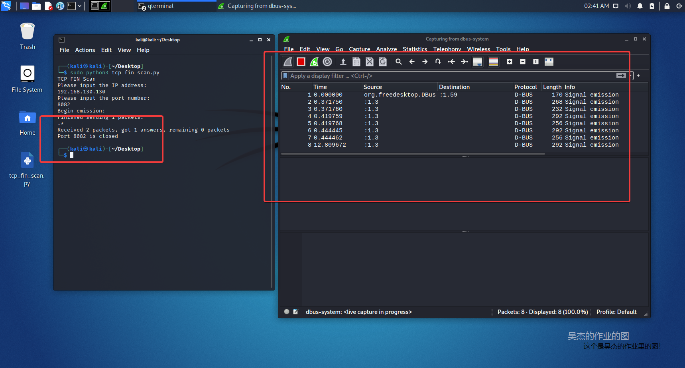
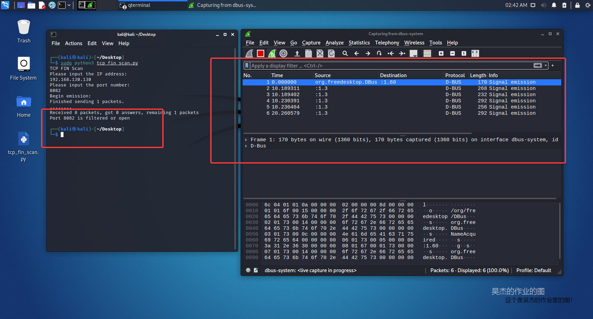
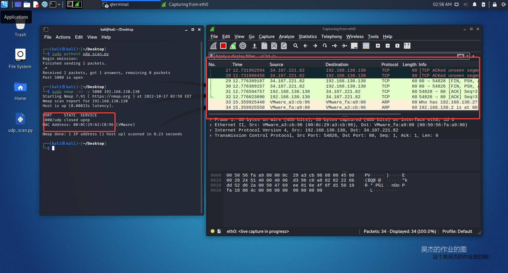

# 实验目的

* 掌握网络扫描之端口状态探测的基本原理

# 实验环境

python + scapy

# 实验要求

* 完成以下扫描技术的编程实现
    * [x]  TCP connect scan / TCP stealth scan
    * [x]  TCP Xmas scan / TCP fin scan / TCP null scan
    * [x]  UDP scan
* [x]  上述每种扫描技术的实现测试均需要测试端口状态为：开放、关闭 和 过滤 状态时的程序执行结果
* [x]  提供每一次扫描测试的抓包结果并分析与课本中的扫描方法原理是否相符？如果不同，试分析原因
* [x]  在实验报告中详细说明实验网络环境拓扑、被测试 IP 的端口状态是如何模拟的
* [x]  复刻 nmap 的上述扫描技术实现的命令行参数开关

经过长时间的学习与实践，已经完成了上述所有的实验要求，并且给出了相关的测试结果和截图。

# 实验准备

这次实验使用了两台虚拟机，一台是ubuntu的虚拟机，一台是kali的虚拟机，使用的是vmware软件。utuntu的虚拟机用来当做被攻击的虚拟机，kali的虚拟机用来当做发动攻击者的虚拟机。

在实验开始之前需要配置两个虚拟机的网络，使得两个虚拟机能够相互连通。

本次实验中我将两个虚拟机放在同一个内部网络当中，他们俩在同一个局域网，同时通过nat网络地址访问的方式，将发往外网的流量使用主机上的nat软件进行转发，使其能够访问外网的同时两者之间还能互相访问，这需要在vmware的软件当中进行配置。以下是我的配置，这里其实并不需要网关，因为vware本身就有部分网关的功能，可以为两个虚拟机分配不同的IP地址，使得两个虚拟机可以通过IP地址进行通信。


随后使用`ifconfig`命令，查看二者的ip地址。


下面测试两个虚拟机的连通信，使用ping命令，从kali向ubuntu发送ping命令，发现可以成功到达，这样就证明两台虚拟机可以相互访问。


同时经过测试，这两台主机也能够访问互联网，但这其实并不是本次实验所必须。这两台主机只要能够相互通信，就可以达到本次实验的环境要求，因此可以使用局域网，也就是并不需要上网，也能够完成这次实验。但是局域网内需要有网关的存在，在VBox当中可以使用之前配置好的低变网关，在vmware当中则使用其自带的网关和dhcp服务器即可，这样的目的是能够保证虚拟机分配到IP地址，并且通过IP地址进行通讯，已完成后续的实验操作。如果虚拟机没有分配到IP地址的话，两台不同的虚拟机就无法在同一个网络当中找到对方，这时候只能依靠手动指定IP地址来实现通讯，这样需要更改大量的配置文件，相较于前一种方法就显得比较繁琐。因此在局域网内设置一台网关或是使用虚拟机软件自带的网关和DCHP服务器，是比较简单的解决的办法。

# 端口状态模拟


在前面的过程当中已经成功完成了两个虚拟机以及两个虚拟机之间网络拓扑的构建，两个虚拟机在同一个内网当中可以通过vmware软件自带的DHCP服务器分配到内网的IP地址，相互访问。其中kali虚拟机被当做是模拟攻击者所使用的主机，而ubuntu的虚拟机被当做是模拟被攻击者所使用的主机，因此接下来需要对被攻击者所使用的主机，也就是ubuntu虚拟机进行设置，模拟真实情况当中的靶机状态。

在真实情况当中被攻击者主机上许多端口是打开的，这也给了攻击者进行攻击的机会，因此我们在实验的时候需要将这些端口手动的打开，模拟真实的环境。


在本次实验当中我选用的TCP服务是NGINX服务器，这是一个HTTP的服务器，可以提供网页的访问和资源的下载，因为是基于HTTP的，所以底层肯定是TCP的协议。而udp协议我选用的是DNSmasq这个软件，它是一款DNS服务器，因此是基于udp协议的。

在本次实验当中我选用的是Docker虚拟容器来安装和启动这两个软件，这样做有以下几个原因：

- Docker在安装的时候比较方便，只需要一条命令就可以自动拉取镜像，并且根据镜像进行下载和自动的安装启动。
- 本次实验涉及到多种扫描方式，因此可以使用多个很方便的创建多个容器，也就是监听多个端口。
- Docker所占用的资源较小，对于物理机的压力也比较小。


使用以下命令来创建nginx服务器，并且在控制台当中进行运行。随后在浏览器中打开可以看到成功访问到了Nginx的主页，因为浏览器使用的是HTTP协议，其底层是基于TCP的，所以这个时候肯定已经成功监听了80端口。


```
sudo docker run -d  -p 80:80 nginx
```


同样的用下面这条命令来运行dnsmasq，这个软件两条命令当中的-p参数表示的是端口的映射，前面一个数字是监听虚拟机的端口，而后面一个数字则是容器内对应的端口，后面的数字是在配置文件当中配置好的，我们只需要修改前面的数字就可以更改本地的端口了。

```
sudo docker run -d  -p 53:53 jpillora/dnsmasq
```


在本期实验当中防火墙也起到很重要的作用，因此需要对防火墙进行配置。首先先通过命令行输入以下命令，查看防火墙当前的状态，可以看到这个时候防火墙是并没有启动的，因此我们可以尝试手动开启防火墙，并且尝试添加端口的规则，也就是针对不同的端口和端口中不同的协议进行防火墙规则的设置，完成了端口监听环境的搭建和防火墙的测试，就可以开始下面的实验了。


启动防火墙


添加端口规则


```
sudo ufw deny 80/tcp
sudo ufw deny 54/udp
```


# TCP connect scan


原理很简单，与目标端口建立3次握手，如果成功建立则为open，收到RST则为close。


编写[tcp_connect_scan.py](scripts/tcp_connect_scan.py)，其内容如下：


```python
from scapy.all import *
# 从scapy.all中导入所有的函数，这样就可以直接使用函数名而不用加上scapy.all.前缀
def tcp_connect(dst_ip, dst_port, timeout=10):
    # 定义一个函数，用于TCP连接扫描
    pkts = sr1(IP(dst=dst_ip) / TCP(dport=dst_port, flags="S"), timeout=timeout)
    # 发送一个TCP SYN包，等待回应
    if pkts is None:
        # 如果没有收到回应，说明目标被过滤了
        print("Port %d is filtered" % dst_port)
    elif (pkts.haslayer(TCP)):
        # 如果收到了回应，但是TCP层的flags字段不是SA，说明目标端口是关闭的
        if (pkts.getlayer(TCP).flags == 0x12):
            # 发送一个TCP RST包，用于释放连接
            send_rst = sr(IP(dst=dst_ip) / TCP(dport=dst_port, flags="AR"), timeout=timeout)
            print("Port %d is open" % dst_port)
            # 如果收到了回应，且TCP层的flags字段是RA，说明目标端口是打开的
        elif (pkts.getlayer(TCP).flags == 0x14):
            print("Port %d is closed" % dst_port)

print("TCP Connect Scan")
print("Please input the IP address:")
dst_ip = input()
print("Please input the port number:")
dst_port = int(input())
tcp_connect(dst_ip, dst_port)
```


## 端口关闭


8080是关闭的


kali发送syn，80回复RST/ACK。


## 端口开启

```
sudo docker run -d  -p 8080:80 nginx
```


kali发送 SYN，80握手，回复SYN/ACK，kali回复 RST。

## 开启防火墙


```
sudo ufw enable
sudo ufw deny 8080/tcp
```


80端口无回应


## NMAP

```
nmap -sT -p 8080 192.168.130.130
```


# TCP stealth scan


通过发送一个SYN包（是TCP协议中的第一个包）开始一次SYN的扫描。任何开放的端口都将有一个SYN|ACK响应。如果攻击者发送一个RST替代ACK，连接中止。


编写[tcp_stealth_scan.py](scripts/tcp_stealth_scan.py)，代码如下：


```python
from scapy.all import *
# 从scapy.all中导入所有的函数，这样就可以直接使用函数名而不用加上scapy.all.前缀
def tcpstealthscan(dst_ip, dst_port):
    pkts = sr1(IP(dst=dst_ip) / TCP(dport=dst_port, flags="S"), timeout=10)
    # 发送一个TCP SYN包，等待回应
    if (pkts is None):
        # 如果没有收到回应，说明目标被过滤了
        print("Port %d is filtered" % dst_port)
    elif (pkts.haslayer(TCP)):
        # 如果收到了回应，但是TCP层的flags字段不是SA，说明目标端口是关闭的
        if (pkts.getlayer(TCP).flags == 0x12):
            send_rst = sr(IP(dst=dst_ip) /
                          TCP(dport=dst_port, flags="R"), timeout=10)
            print("Port %d is open" % dst_port)
        elif (pkts.getlayer(TCP).flags == 0x14):
            print("Port %d is closed" % dst_port)
        elif (pkts.haslayer(ICMP)):
            if (int(pkts.getlayer(ICMP).type) == 3 and int(stealth_scan_resp.getlayer(ICMP).code) in [1, 2, 3, 9, 10,
                                                                                                      13]):
                print("Port %d is filtered" % dst_port)


print("TCP Stealth Scan")
print("Please input the IP address:")
dst_ip = input()
print("Please input the port number:")
dst_port = int(input())
tcpstealthscan(dst_ip, dst_port)
```


## 开启防火墙


## 关闭防火墙，关闭端口


## 关闭防火墙，开启端口


```
sudo docker run -d  -p 8081:80 nginx
```


## NMAP


```
sudo nmap -sS -p 8081 192.168.130.130
```


# TCP Xmas scan

客户端向服务端发送带有 PSH，FIN，URG 标识的数据包(即不含有ACK SYN RST)，被称为TCP Xmas Tree扫描。其利用的是RFC的规定: 如果不设置SYN，RST，或者ACK位的报文发送到开放端口，理论上，这不应该发生，如果您确实收到了，丢弃该报文，返回。那么就有： 如果扫描系统遵循该RFC，当端口关闭时，任何不包含SYN，RST，或者ACK位的报文会导致 一个RST返回而当端口开放时，应该没有任何响应。只要不包含SYN，RST，或者ACK, 任何其它三种(FIN，PSH，and URG)的组合都行。

编写[tcp_xmas_scan.py](scripts/tcp_xmas_scan.py)，内容如下：

```python
# encoding:utf-8
from scapy.all import *


# 从scapy.all中导入所有的函数，这样就可以直接使用函数名而不用加上scapy.all.前缀


def tcp_Xmas_scan(dst_ip, dst_port, timeout=10):
    pkts = sr1(IP(dst=dst_ip) / TCP(dport=dst_port, flags="FPU"), timeout=10)
    # 发送一个TCP SYN包，等待回应
    if (pkts is None):
        print("Port %d is filtered or open" % dst_port)
    elif (pkts.haslayer(TCP)):
        if (pkts.getlayer(TCP).flags == 0x14):
            print("Port %d is closed" % dst_port)
    elif (pkts.haslayer(ICMP)):
        if (int(pkts.getlayer(ICMP).type) == 3 and int(pkts.getlayer(ICMP).code) in [1, 2, 3, 9, 10, 13]):
            print("Port %d is filtered" % dst_port)


tcp_Xmas_scan('192.168.130.130', 9090)

```


## 开启防火墙


## 关闭防火墙，关闭端口


## 关闭防火墙，开启端口


```
sudo docker run -d  -p 9090:80 nginx
```


## NMAP

```
sudo nmap -sX -p 9090 192.168.130.130
```


# TCP fin scan

当申请方主机向目标主机一个端口发送的TCP标志位FIN置位的数据包，如果目标主机该端口是“关”状态，则返回一个TCP RST数据包；否则不回复。根据这一原理可以判断对方端口是处于“开”还是“关”状态。这种方法的缺点是，该原理不是协议规定，因而与具体的协议系统实现有一定的关系，因为有些系统在实现的时候，不管端口是处于“开”还是“关”状态，都会回复RST数据包，从而导致此方法失效。不过，也正因为这一特性，该方法可以用于判断对方是UNIX操作系统还是Windows操作系统。

编写[tcp_stealth_scan.py](scripts/tcp_stealth_scan.py)，内容如下：


```python
from scapy.all import *
# 从scapy.all中导入所有的函数，这样就可以直接使用函数名而不用加上scapy.all.前缀
print("TCP FIN Scan")
print("Please input the IP address:")
dst_ip = input()
print("Please input the port number:")
dst_port = int(input())
src_ip = "192.168.130.128"
src_port = RandShort() 

fin_scan_pkt = sr1(IP(dst=dst_ip) / TCP(dport=dst_port, flags="F"), timeout=10)
# 发送一个TCP FIN包，等待回应
if (str(type(fin_scan_pkt)) == "<class 'NoneType'>"):
    print("Port %d is filtered or open" % dst_port)
elif (fin_scan_pkt.haslayer(TCP)):
    if (fin_scan_pkt.getlayer(TCP).flags == 0x14):
        # 接收 RST 包，说明端口是关闭的
        print("Port %d is closed" % dst_port)
    elif (fin_scan_pkt.haslayer(ICMP)):
        # 接收 ICMP 包，说明端口被过滤了
        if (int(fin_scan_pkt.getlayer(ICMP).type) == 3 and int(fin_scan_resp.getlayer(ICMP).code) in [1, 2, 3, 9, 10,
                                                                                                      13]):
            print("Port %d is filtered" % dst_port)
```


## 开启防火墙


## 关闭防火墙，关闭端口





## 关闭防火墙，开启端口

```
sudo docker run -d  -p 8082:80 nginx
```





## NMAP

```
sudo nmap -sF -p 8082 192.168.130.130
```


# TCP null scan


空扫描即flag位全 0 ，如果没有回复则为open，收到RST则为close


编写[tcp_null_scan.py](scripts/tcp_null_scan.py)，其内容如下：


```python
from scapy.all import *


# 从scapy.all中导入所有的函数，这样就可以直接使用函数名而不用加上scapy.all.前缀


def tcp_null_scan(dst_ip, dst_port):
    pkts = sr1(IP(dst=dst_ip) / TCP(dport=dst_port, flags=""), timeout=10)
    # 发送一个TCP SYN包，等待回应
    if (pkts is None):
        print("Port %d is filtered or open" % dst_port)
    elif (pkts.haslayer(TCP)):
        if (pkts.getlayer(TCP).flags == 0x14):
            print("Port %d is closed" % dst_port)
    elif (pkts.haslayer(ICMP)):
        if (int(pkts.getlayer(ICMP).type) == 3 and int(pkts.getlayer(ICMP).code) in [1, 2, 3, 9, 10, 13]):
            print("Port %d is filtered" % dst_port)


tcp_null_scan('192.168.130.130', 8083)
# 为了方便测试，这里直接写了IP地址和端口号，实际使用时可以从命令行获取

```

## 开启防火墙


## 关闭防火墙，关闭端口


## 关闭防火墙，开启端口


```
sudo docker run -d  -p 8083:80 nginx
```


## NMAP


```
sudo nmap -sN -p 8083 192.168.130.130
```


# UDP scan


原理：向目标主机的UDP端口发送探测包。 如果收到回复“ICMP port unreachable”就说明该端口是关闭的； 如果没有收到回复，那说明UDP端口可能是开放的或屏蔽的。

编写[udp_scan.py](scripts/udp_scan.py)，内容如下：


```python
# encoding:utf-8
from scapy.all import *


# 从scapy.all中导入所有的函数，这样就可以直接使用函数名而不用加上scapy.all.前缀
def udp_scan(dst_ip, dst_port, dst_timeout=10):
    resp = sr1(IP(dst=dst_ip) / UDP(dport=dst_port), timeout=dst_timeout)
    # 发送一个UDP包，等待回应
    if (resp is None):
        print("Port %d is open or filtered" % dst_port)
    elif (resp.haslayer(UDP)):
        # 接收到UDP包，说明端口是开放的
        print("Port %d is open" % dst_port)
    elif (resp.haslayer(ICMP)):
        if (int(resp.getlayer(ICMP).type) == 3 and int(resp.getlayer(ICMP).code) == 3):
            print("Port %d is closed" % dst_port)
        elif (int(resp.getlayer(ICMP).type) == 3 and int(resp.getlayer(ICMP).code) in [1, 2, 9, 10, 13]):
            print("Port %d is filtered" % dst_port)
        elif (resp.haslayer(IP) and resp.getlayer(IP).proto == IP_PROTOS.udp):
            print("Port %d is open" % dst_port)


udp_scan('192.168.130.130', 5000)
# 为了方便测试，这里直接写了IP地址和端口号，实际使用时可以从命令行获取
```


## 开启防火墙


## 关闭防火墙，关闭端口


## 关闭防火墙，开启端口

```
sudo docker run -d  -p 5000:53 jpillora/dnsmasq
```


## NMAP


```
sudo nmap -sU -p 5000 192.168.130.130
```





